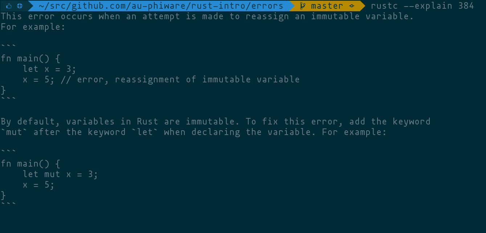

import { dark } from 'mdx-deck/themes'
import nightOwl from "prism-react-renderer/themes/nightOwl"
import { Notes } from 'mdx-deck'
import { CodeSurfer } from "mdx-deck-code-surfer"

export const theme = {
  colors: {
    text: '#d6deeb',
    background: '#011627',
    link: '#08f',
    pre: 'rgb(127, 219, 202)',
    preBackground: '#011627',
    code: '#f0f'
  },
  codeSurfer: {
    ...nightOwl,
  }
}

# Introduction to Rust

<center>


</center>

<Notes>
For the past 3 weeks I've been teaching myself Rust,

a relatively new systems programming language by Mozilla.
</Notes>

---

# Why Rust?

<Notes>
Rust has a lot of things that I like, and I'd like to tell you about some of
them...

First,

I'll go through some features that Rust has pilfered from other languages.

And, I'll end with it's most unique features.
</Notes>

---

# Similiarities with C++

- Static dispatch
- Memory model
- Smart pointers
- No GC
- Minimal runtime
- Monomorphization

<Notes>
In many ways, Rust is trying to replace C++.

It shares
- a static dispatch model,
- smart pointers,
- memory model,
- no GC,
- minimal runtime...

And this affords Rust the ability to be used for writting
- a BIOS,
- kernel modules,
- drivers,
- WASM,
- Ruby plugin,

Anywhere, resources are limited or constrained

But one of the greatest advantages of C++ is its performance.

And this is due, in part, to its zero-cost abstractions
aka the zero-overhead principle.
</Notes>

---

# Zero-cost Abstractions

> You don’t pay for what you don’t use
>
> What you use, you couldn’t have hand-coded better


<Notes>
Now, I don't know a lot about C++, but

Rust's uncompromising commitment to this principle

has lead to incredibly well thought-out language features and

what the language doesn't provide, you can opt-in with a library;

For example,

Rust has a generic type system,

but the compiler performs monomorphization,

which is the process of turning generic types at compile time to specilized
runtime types.

So this effectively generates many types depending on how the generic type is
used.

Rust's commitment to this principle is so strong that prior to the release of v1,

Rust had a GC and an implementation of "green threads" (think Go's goroutines)

built into the language but they were dumped because they didn't meet this high
requirement of zero-cost.

3:30
</Notes>

---

# Build Tools

```
rustup
```

```
cargo
```

<Notes>
Rust comes with many modern conveniences; and its build tools have a nice and
consistent CLI.

So `rustup` is the only thing you need to get started;

you use it to
- update the toolchain,
- switch between release channels and
- mess with cross-compilers.

But your day-to-day Rust work is done with `cargo`; you use it
- to start and/or publish projects,
- manage and install dependencies,
- build and/or run your project,
  - or its tests,
  - or its documentation...

And tests are not just unit tests, or integration tests, its also
- benchmarks, or
- examples in your documentation.

Importantly rustup and cargo are extensible; you can install static analysers,
linters, formatters

I've been playing with a tool called `cargo-fuzz` recently, which wraps the C
libFuzzer engine for LLVM, its real cool...
</Notes>

---

# Types and Traits

<Notes>
Rust's type system is heavily inspired by OCaml and Haskell, and

even the logic system of Prolog.

I'm not familar with any of these languages, but suffice to say it's quite different to

what I do know from statically typed languages (such as
Java and C#).

For starters, there's no inheritance, but that's a another topic...

I do want to mention that Rust has

no `null` or `nil` value;
- it doesn't have a keyword;
- it doesn't exist;
- nor do
  - null pointer exceptions, or
  - none errors, or
  - undefined references, or
  - whathaveyou;

they just don't happen.
</Notes>

---

> I call it my billion-dollar mistake. It was the invention of the null reference
> in 1965.

-- Tony Hoare, inventor of the ~~null reference~~ quicksort algorithm

<Notes>
5:30

Tony Hoare famously said

"I call it my billion-dollar mistake. It was the invention of the null reference
in 1965."

Okay, so, they must have had some merit;

but I assure you, the compiler just does not care;

it doesn't want to know about it.

So, what's the compromise?
</Notes>

---

<CodeSurfer
  title="Types and Traits"
  code={require("!raw-loader!./option.rs")}
  lang="rust"
  showNumbers={true}
  steps={[
    { ranges: [[150,157]] },
    { tokens: {150: [2,3,4]} },
    { tokens: {153: [0]} },
    { tokens: {150: [5,6,7]} },
    { lines: [156] },
    { tokens: {156: [2,3,4]} },
    { ranges: [[150,157]] },
  ]}
/>

<Notes>
Well, Rust has this `Option` thing, where you can opt-in to a `None` value or a
value of `Some` thing.

Okay, so it looks simple enough but there's a lot syntax here...

&#x27ab; First off, we have an enum declaration.

Rust enums are not like C enums; they're actually part of the type system.

&#x27ab; `None` is a type that only has a single, constant value; it can be thought of as a singleton, if you like.

&#x27ab; `Option` has a declared type parameter `T`, this is

Rust's generics or bounded parametric polymorphism.

&#x27ab; The type `T` is used as the inner type of the `Some` type, this is known
as a 'newtype'.

A value of `Some` acts as a wrapper around a value of type `T`.

&#x27ab; To be clear, the parans, here, denote a tuple. That is, an ordered list
of values that can be declared to have different types.  In this case we have a
single value of type `T`.

&#x27ab; One of the neat things of type parameters is that the bounds of its type
parameter is determined by its implementation.
</Notes>

---

<CodeSurfer
  title="Types and Traits"
  code={require("!raw-loader!./default.rs")}
  lang="rust"
  showNumbers={true}
  steps={[
    { ranges: [[84,116]] },
    { tokens: {84: [3,4]} },
    { lines: [115] },
  ]}
/>

<Notes>
8:00

This is the declaration of the `Default` trait.

&#x27ab; It allows a type to define a useful default value for itself.

The trait defines the contract that implementations must provide.

&#x27ab; In this case, a `default` function that returns `Self`;

`Self` is a keyword used to denote the implentor's type.

QUESTIONS

What would be a useful default type? `None`? Or maybe the default value of
`T`...?
</Notes>

---

<CodeSurfer
  title="Types and Traits"
  code={require("!raw-loader!./option.rs")}
  lang="rust"
  showNumbers={true}
  steps={[
    { ranges: [[1044,1048]] },
    { tokens: {1047: [14]} },
    { tokens: {1044: [1,2,3,4]} },
  ]}
/>

<Notes>
9:00

So, this is the `impl` block of the `Default` trait for the `Option&lt;T&gt;`
type.

&#x27ab; We can see the authors of the standard library have elected to go with
`None`.

&#x27ab; This is where the type parameter is declared;

and we can see that it has no contraints;

the `Default` trait is implemented for all types of `T`.

So what if the default value of `T` is more useful for our particular application
or scenario, and we don't care about None?
</Notes>

---

<CodeSurfer
  title="Types and Traits"
  code={require("!raw-loader!./option.rs")}
  lang="rust"
  showNumbers={true}
  steps={[
    { ranges: [[956,960]] },
    { tokens: {955: [...Array(7).keys()]} },
  ]}
/>

<Notes>
Well, the `Option` type has the `unwrap_or_default` method.

If the `Option` is wrapping some value, it will return it (i.e. unwrap),

otherwise if the `Option` is `None` it will return the default value according to
the type `T`.

For this to hold true; `T` must implements the `Default` trait.

&#x27ab; And this is expressed as a constraint on the type parameter `T`.

So, the methods in this `impl` block are

only valid for `Option` types that

wrap types that implement the `Default` trait; and

Rust can reason about all these types at compile time.

10:45
</Notes>

---

# `Option<bool>` &#x2225; `Option<UserStruct>`

<Notes>
Essentially `Option&lt;bool&gt;` will be a separate type to
`Option&lt;CustomStruct&gt;` that exists in parallel with a potentially different
set of methods.

And computers are good at keeping track of all these differences.

Traits are pervasive throughout Rust,

many language features and operators can be extended for your custom types,
including
- arthemetic,
- `for` loops,
- the deref operator (`*`),
  - which is how you can implement your own smart pointers.

Newtypes (the type wrapping another type)

are zero-cost,

they add nothing to the runtime but

they inform the compiler about your type's semantics and

what methods and operations are valid.

QUESTIONS 11:45
</Notes>

---

# `rustc` Error Messages


<Notes>
Error messages from the Rust compiler aren't just cryptic one-liners and a
stacktrace...

They print multiple spans of text

from the source code that produced the error.

And actually try to help you fix your code,

in this way they are like Elm's pretty error messages.

For example, here we have simple case of assigning a value to a variable name
after it has been declared.

Simple enough for most languages, but not for Rust!

Sure, you may not like the fact that these two lines of code produce an error but

all is forgiven when you actually read it.

Rust prints the two lines of code (with line numbers),

points out the span of text that produced the error (with the error message
repeated below it),

it also points out where the variable is declared and

then suggests a fix!

And if that wasn't enough, you can run the compilier with the explain option.
</Notes>

---

# `rustc` Error Messages



<Notes>
The explaination comes complete with examples for both the problem and the fix.

13:15
</Notes>

---

# Functional Programming Paradigm

- Expression-based syntax

  - everything is an expression; `if`, `while`, blocks

  - the semicolon is effectively a "statement operator"

- Closures

<Notes>
Rust takes inspiration from many functional programming languages.

Everything is an expression, which

means they can be composed together into compound expressions.

The semicolon takes on a subtly different meaning,

it's less of a separator and more of an operator that converts an expression into
a statement,

the difference is the value that the statement is evaluated to.

14:00
</Notes>

---

<CodeSurfer
  title="Macros"
  code={require("!raw-loader!./macros.rs")}
  lang="rust"
  steps={[
    { ranges: [[1,24]] },
    { ranges: [[25,48]] },
    { ranges: [[49,72]] },
    { ranges: [[73,96]] },
  ]}
/>

<Notes>
Rust's macros are influenced by Scheme, and are

very different to the C preprocessor.

A macro is a function that is executed by the compiler, which is

able to make arbitrary transformations to the source code

prior to the code being compiled.

This affords the macro author the ability to
- introduce a new syntax, or
- transform declarative code into imperative code.

&#x27ab; For example, the `json` macro in the `serde_json` crate teaches the
compiler JSON syntax.

To say that this is JSON is a lie, each expression is actually a Rust expression,
but that's arguably more powerful!

&#x27ab; The `sql` macro in the `postgres_macros` crate, parses the SQL string
using PostgreSQL's C libraries, giving you the full power of PostgreSQL's server
in the Rust compiler!

&#x27ab; The `vec` macro in the standard library (and automatically included)
effectively rewrites a literal array into series of `push` calls on a growable
vector.

15:30
</Notes>

---

<CodeSurfer
  title="Pattern Matching"
  code={require("!raw-loader!./patterns.rs")}
  lang="rust"
  steps={[
    { ranges: [[1,24]] },
    { ranges: [[25,48]] },
    { ranges: [[49,72]] },
    { ranges: [[73,96]] },
  ]}
/>

<Notes>
Pattern matching is another pervasive feature and inspired by OCaml.

&#x27ab; Patterns can be used in `let` statements; this gives us destructuring.

In this example the fields of `self` are bound to variables with the same names.

Patterns in `let` statements must be irrefutable, meaning that every possible
value must pass the pattern.

&#x27ab; `let` can be combined with `if` or `while`, a passing value will execute
the block.

Patterns in this scenario are called refutable.

&#x27ab; But it's more common to use the `match` construct.

The compiler will verify that for any possible value that at least one of the
patterns will pass;

`match` must be exhaustive.

These rules about irrefutability and exhaustiveness

help to catch bugs at runtime

and make refactoring easier.

16:45
</Notes>

---

# Memory Safety

<Notes>
Rust's most unique feature is its relentless borrow-checker,

which enforces memory safety in programs and eliminates whole classes of
bugs.

Some language have a GC that keeps track of all references into memory and
periodically frees unused memory at runtime.

Other languages expect you, the programmer, to free memory when you're done with
it.

Both have their problems, but the former is considered 'safe' in terms of memory
handling.

**Rust is both safe and without a GC.**

It achieves this by using its type system and some specialized syntax.

17:45
</Notes>

---

# Borrowing & Ownership

<Notes>
Central to this memory safety is the idea of ownership.

The idea is simple: your program owns a hunk of memory, holds a reference to it,
and when that reference goes out of scope the memory can be dropped.

Problems quickly arise when you want
- to share that memory,
- pass it to an enclosing scope or
- have multiple threads.

Rust's compiler uses
- a notion of ownership transfers,
- borrows,
- reference lifetimes and
- mutability.

These ideas are easy to grasp in a naive way,

but contain many subtleties that can be difficult to master.

Thankfully, computers are great at nitpicking;

it's common for beginners to have 'fights' with the borrow-checker that is
builtin to `rustc`...

And it feels really good when you win those fights;

and even if you don't, your program will be free of bugs

that it would have otherwise had.
</Notes>

---

# Fearless Concurrency

<Notes>
19:00

It turns out that the ideas of borrowing and ownership, have

parallels with techniques used to write bug-free concurrent programs and parallel
processing.

The Rust community have this catch phrase of *fearless concurrency*, which

refers to the idea that the Rust compiler makes some bugs impossible

(or at least very difficult to write)!
</Notes>

---

<center>

# Demo: Threads

## [ruby multithreaded primer](https://lmgtfy.com/?iie=1&q=ruby+multithreaded+primer)

</center>

<Notes>
19:30

Okay, demo time &#x1f64f;

I'm going to pick on another language to demo what can go wrong with threads.

One of Rust's influences that I haven't mentioned yet is Ruby:

 so let's Google `ruby multithreaed primer`.

The first hit is by some guy called Eqbal Quran, sorry 'Eki'.
</Notes>

---

# Community

- Open
  - Open source
  - Open governance; owned by the Mozilla **Foundation**
  - Open minded; building software and concensus

- Balancing trade-offs

- RFC process

<Notes>
One of Rust's greatest assets is its community;

run by a foundation, and not a corporation,

it draws from a wide pool of experiences to

ensure that the trade-offs of new features are critically evaluated.
</Notes>

---

<center>

# Thank You

</center>

## https://github.com/au-phiware/rust-intro

